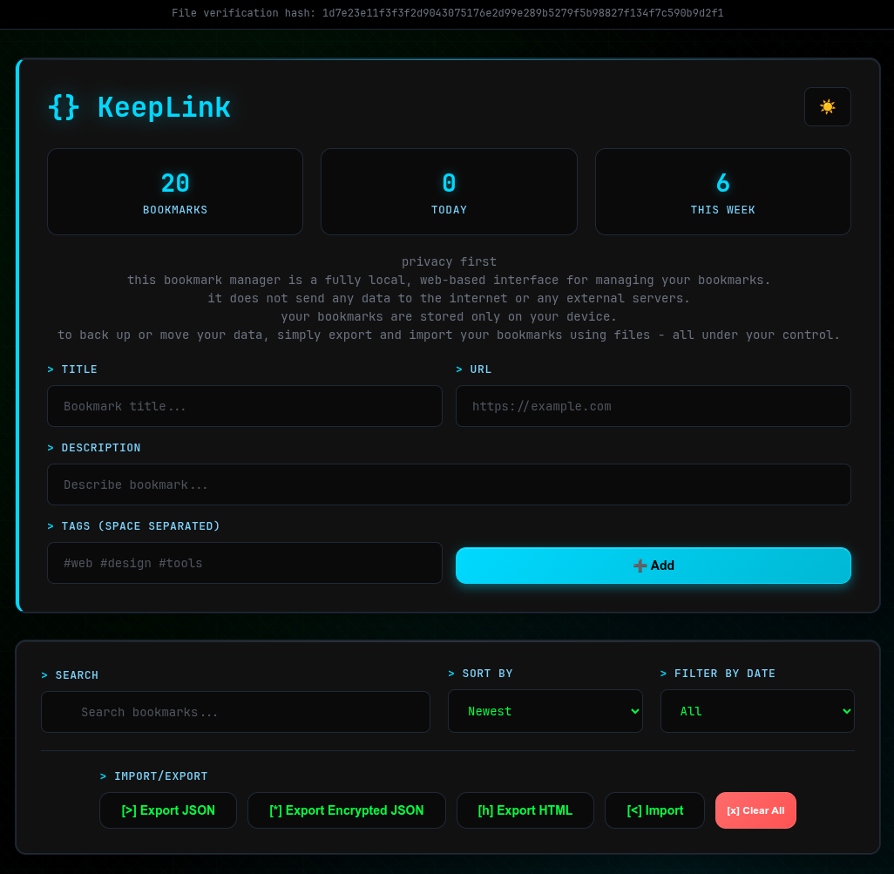

# KeepLink – Local Bookmark Manager

**KeepLink** is a fully local, web-based bookmark manager designed with user privacy in mind.  
No data is sent to the internet or stored on external servers — everything stays on your device.

## Features

- Fully local bookmark storage — no external databases or APIs.  
- Web interface running directly in your browser.  
- The manager calculates and displays a hash of the current interface, so you can verify that it is the original, unmodified version without any added components that could track the user.  
- No telemetry, ads, or tracking.  
- Easy export and import of bookmarks as files.  
- Option to export bookmarks as an **encrypted file** for additional security.  
- Fast search through saved links.  
- Emergency button for quick deletion of all bookmarks from the browser storage.

## Export and Import

- **Export** — save bookmarks to a `.json` file.  
- **Encrypted export** — bookmarks are securely encrypted using AES-256-GCM with PBKDF2 (100,000 iterations).  
  - A random salt and initialization vector (IV) are generated for each export.  
  - Encrypted files are saved with the `.enc` extension.  
- **Import** — load a previously saved file (including encrypted `.enc` files) to restore bookmarks.

## Why Privacy?

In the age of cloud services and constant tracking, **KeepLink** gives you complete control over your data.  
Your bookmarks are stored only in your browser and on your disk — with no intermediaries.

## Testing via Tor Network

For users who prioritize privacy and anonymity, **KeepLink** can be tested and used over the Tor network.  
This allows you to access the application without revealing your IP address or other identifying information.

You can test the app on Tor using the following address:  
`http://d5pd3zrfrqillmmkoyak5fnmzlu5ejdie4v6iihmxodfcenmlepe6kid.onion`

## User interface screenshot

